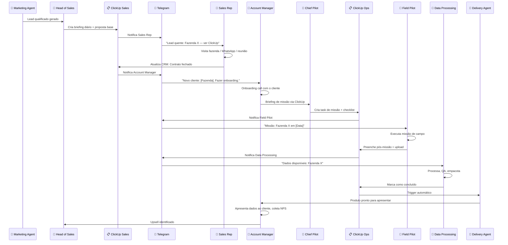

# Agrostech — Organograma & Estrutura de Agentes

## Modelo Organizacional: Holacracia + OKR + Híbrido IA-Humano

A Agrostech opera com um **modelo híbrido inteligente**: agentes digitais tomam decisões, planejam e orquestram — trabalhadores humanos executam onde a presença, o julgamento e o relacionamento são insubstituíveis. O ClickUp e o Telegram são as pontes que conectam estes dois mundos.

> **Princípio v2.0:** *"A IA equipa o humano. O humano executa com excelência. O ClickUp e o Telegram garantem que nenhum detalhe se perca entre os dois."*

---

## Organograma Visual

```mermaid
graph TD
    CEO["🧠 CEO Agent<br/>Visão · Decisões Estratégicas · OKRs"]

    CEO --> COO["⚙️ COO Agent<br/>Operações · Escala · Processos"]
    CEO --> CFO["💰 CFO Agent<br/>Finanças · Margem · Caixa"]
    CEO --> HOS["📈 Head of Sales Agent<br/>Pipeline · Forecast · Proposta · Alertas"]

    %% Operations Layer
    COO --> CP["🚁 Chief Pilot Agent<br/>Planejamento de Missão · ANAC · DECEA"]
    COO --> CU_OPS["📋 ClickUp / Ops<br/>Tarefas de Campo"]
    CP --> FP_H["👷 Field Pilot<br/>⚠️ HUMANO<br/>Execução · Log · Dados"]
    CP --> DP_H["🗺️ Data Processing<br/>⚠️ HUMANO<br/>Ortofoto · NDVI · QA"]
    CU_OPS --> FP_H
    CU_OPS --> DP_H

    %% Sales Layer
    HOS --> MKT["📣 Marketing Agent<br/>Estratégia · Campanhas · Leads"]
    HOS --> CU_COM["📋 ClickUp / Sales<br/>Briefings · Propostas · CRM"]
    MKT --> CD["🎬 Content Director<br/>Calendário · Briefings · Gate"]
    CD --> IMG["🖼️ Instagram Image Agent<br/>Imagens · Carrosséis · Stories"]
    CD --> REL["📹 Instagram Reels Agent<br/>Roteiros · Vídeos · Voice-over"]
    CD --> TT["📱 TikTok Agent<br/>Gen-Z · Millennial · Trends"]
    CD --> VI["🎨 Visual Identity Agent<br/>Guia de Marca · Revisão"]
    CU_COM --> SR1["👔 Sales Rep 1<br/>⚠️ HUMANO — MT/GO"]
    CU_COM --> SR2["👔 Sales Rep 2<br/>⚠️ HUMANO — PR/RS"]
    CU_COM --> SR3["👔 Sales Rep 3<br/>⚠️ HUMANO — Carbono"]
    CU_COM --> SR4["👔 Sales Rep 4<br/>⚠️ HUMANO — Cooperativas"]

    %% Client Success
    DP_H --> AM_H["🤝 Account Manager<br/>⚠️ HUMANO<br/>Onboarding · NPS · Upsell"]
    SR1 --> AM_H
    SR2 --> AM_H
    SR3 --> AM_H
    SR4 --> AM_H
    AM_H --> DEL["📦 Delivery Agent<br/>Empacotamento · Handoff"]

    %% Support Layer
    CEO --> SUP["🔧 Support Layer"]
    SUP --> LEG["⚖️ Legal/Compliance Agent<br/>ANAC · Contratos · LGPD"]
    SUP --> FIN["🧾 Finance Agent<br/>NF · Fluxo de Caixa · Impostos"]
    SUP --> KNW["🧠 Knowledge Agent<br/>SOPs · Memória · Treinamento"]

    %% Telegram
    TG["📱 Telegram Bot<br/>Acesso por Papel · Restrito"]
    TG --> FP_H
    TG --> DP_H
    TG --> SR1
    TG --> SR2
    TG --> SR3
    TG --> SR4
    TG --> AM_H

    style FP_H fill:#f0a500,color:#000,stroke:#cc8800
    style DP_H fill:#f0a500,color:#000,stroke:#cc8800
    style SR1 fill:#e07b00,color:#fff,stroke:#b55e00
    style SR2 fill:#e07b00,color:#fff,stroke:#b55e00
    style SR3 fill:#e07b00,color:#fff,stroke:#b55e00
    style SR4 fill:#e07b00,color:#fff,stroke:#b55e00
    style AM_H fill:#f0a500,color:#000,stroke:#cc8800
    style CU_OPS fill:#7B61FF,color:#fff,stroke:#5a45d4
    style CU_COM fill:#7B61FF,color:#fff,stroke:#5a45d4
    style TG fill:#229ED9,color:#fff,stroke:#1a7aaa
    style CD fill:#2D5016,color:#fff,stroke:#1a3009
    style IMG fill:#4a7a28,color:#fff,stroke:#2D5016
    style REL fill:#4a7a28,color:#fff,stroke:#2D5016
    style TT fill:#4a7a28,color:#fff,stroke:#2D5016
    style VI fill:#4a7a28,color:#fff,stroke:#2D5016
```

**Legenda:**
- 🟣 **Roxo** = Camada ClickUp (orquestra tarefas dos humanos)
- 🟠 **Laranja claro** = Papel Humano — Operations (Field Pilot, Data Processing, Account Manager)
- 🟠 **Laranja escuro** = Papel Humano — Commercial (Sales Reps ×4)
- 🔵 **Azul** = Telegram Bot (canal de acesso dos humanos ao sistema)
- 🟢 **Verde escuro** = Content Director — Orquestrador de conteúdo visual
- 🟢 **Verde médio** = Sub-agentes de conteúdo (Instagram Image, Reels, TikTok, Visual Identity)
- **Sem cor** = Agente Digital puro

---

## Mapa Completo: Quem é Humano × Quem é Digital

| Papel | Tipo | Motivo |
|-------|------|--------|
| CEO | 🤖 Agente Digital | Decisão estratégica baseada em dados |
| COO | 🤖 Agente Digital | Orquestração de operações |
| CFO | 🤖 Agente Digital | Análise financeira e controle |
| Head of Sales | 🤖 Agente Digital | Pipeline, forecast, geração de propostas |
| Marketing | 🤖 Agente Digital | Estratégia de conteúdo e geração de leads |
| **Content Director** | 🤖 Agente Digital | Orquestração do conteúdo visual Instagram + TikTok |
| **Instagram Image Agent** | 🤖 Agente Digital | Geração de imagens, carrosséis e stories |
| **Instagram Reels Agent** | 🤖 Agente Digital | Roteiros e direção criativa de Reels |
| **TikTok Agent** | 🤖 Agente Digital | Conteúdo nativo TikTok para Gen-Z e Millennials |
| **Visual Identity Agent** | 🤖 Agente Digital | Guia de marca, revisão visual, templates |
| Legal/Compliance | 🤖 Agente Digital | Compliance, contratos, regulamentação |
| Finance | 🤖 Agente Digital | Emissão de NF, impostos, fluxo de caixa |
| Knowledge | 🤖 Agente Digital | Memória organizacional, SOPs |
| Delivery | 🤖 Agente Digital | Empacotamento e handoff de produto |
| Chief Pilot | 🤖 Agente Digital | Planejamento de missão, compliance ANAC |
| **Field Pilot** | 👷 **Humano** | Presença física, hab. ANAC, julgamento de campo |
| **Data Processing** | 👷 **Humano** | QA especializado, interpretação agronômica |
| **Sales Rep ×4** | 👷 **Humano** | Relacionamento, negociação, confiança no campo |
| **Account Manager** | 👷 **Humano** | Empatia, NPS, upsell consultivo, QBR |

---

## Descrição de Cada Papel

### 🧠 C-Suite Layer (Agentes Digitais)

| Agente | Arquivo | Foco Principal |
|--------|---------|---------------|
| **CEO** | `agents/c-suite/ceo.md` | Visão de longo prazo, decisões estratégicas, OKRs |
| **COO** | `agents/c-suite/coo.md` | Eficiência operacional, escalonamento de missões |
| **CFO** | `agents/c-suite/cfo.md` | Saúde financeira, margem, caixa, pricing |

---

### 📈 Revenue Layer (Híbrida: IA Orquestra + Humanos Executam)

| Papel | Arquivo | Tipo | Foco Principal |
|-------|---------|------|---------------|
| **Head of Sales** | `agents/sales/head_of_sales.md` | 🤖 Agente Digital | Pipeline, forecast, briefings diários para reps, propostas auto-geradas |
| **Sales Rep ×4** | `agents/sales/sales_rep.md` | 👷 **Humano** | Prospecção, visitas, qualificação, negociação, fechamento |
| **Marketing** | `agents/sales/marketing.md` | 🤖 Agente Digital | Conteúdo, campanhas, geração de leads inbound |

> **Divisão de trabalho comercial:** A IA analisa o pipeline, identifica oportunidades, gera propostas e envia alertas. O Sales Rep humano faz as ligações, as visitas e fecha o negócio — construindo a confiança que nenhum bot consegue replicar no agronegócio.

---

### 🚁 Operations Layer (Híbrida: IA Planeja + Humanos Executam)

| Papel | Arquivo | Tipo | Foco Principal |
|-------|---------|------|---------------|
| **Chief Pilot** | `agents/operations/chief_pilot.md` | 🤖 Agente Digital | Planejamento, DECEA, briefing, validação pós-missão |
| **Field Pilot** | `agents/operations/field_pilot.md` | 👷 **Humano** | Execução de voo, setup de campo, coleta de dados |
| **Data Processing** | `agents/operations/data_processing.md` | 👷 **Humano** | Processamento fotogramétrico, QA, empacotamento |

---

### 🤝 Client Success Layer (Híbrida: IA Suporta + Humano Relaciona)

| Papel | Arquivo | Tipo | Foco Principal |
|-------|---------|------|---------------|
| **Account Manager** | `agents/client-success/account_manager.md` | 👷 **Humano** | Onboarding, NPS, upsell consultivo, QBR presencial |
| **Delivery** | `agents/client-success/delivery.md` | 🤖 Agente Digital | Empacotamento de produto, handoff técnico |

---

### 🔧 Support Layer (Agentes Digitais)

| Agente | Arquivo | Foco Principal |
|--------|---------|---------------|
| **Legal/Compliance** | `agents/support/legal_compliance.md` | ANAC, DECEA, LGPD, contratos |
| **Finance** | `agents/support/finance.md` | NF, fluxo de caixa, impostos |
| **Knowledge** | `agents/support/knowledge.md` | SOPs, memória organizacional, onboarding |

---

### 📋 Integrações de Canal

| Integração | Arquivo | Função |
|-----------|---------|--------|
| **ClickUp — Operations** | `integrations/clickup_integration.md` | Tarefas, briefings e checklists para Field Pilot e Data Processing |
| **ClickUp — Commercial** | `integrations/clickup_integration.md` | Briefings diários, propostas e CRM para Sales Reps e Account Manager |
| **Telegram Bot** | `integrations/telegram_integration.md` | Canal de acesso unificado para todos os funcionários humanos |

---

## Fluxo Completo — IA + Humanos (End-to-End)

---

## Princípios de Governança (v2.0)

1. **Autonomia por papel** — Cada agente decide dentro de seu domínio sem aprovação para ações padrão
2. **Escalação explícita** — Decisões acima do threshold de valor (R$ 10k operacional / R$ 30k comercial) sobem para CEO/COO
3. **Reunião semanal simulada** — CEO sincroniza todos os agentes toda segunda-feira (log em `okrs/`)
4. **Memória compartilhada** — Knowledge Agent é o repositório central de contexto
5. **OKRs trimestrais** — Cada camada tem OKRs em `okrs/` revisados pelo CEO
6. **Humanos suportados pela IA** — Reps, AM, Field Pilot e Data Processing recebem briefings, propostas, checklists e alertas automáticos — sem depender de memorizar o que fazer
7. **Acesso restrito por papel** — Telegram Bot e ClickUp aplicam permissões baseadas no papel de cada funcionário
8. **CRM como fonte da verdade** — Todo contato humano registrado no ClickUp alimenta a IA com dados para melhorar decisões

---

## Mapa de Permissões Completo (ClickUp + Telegram)

| Papel | Tipo | ClickUp Space | Telegram Bot | Comandos Telegram |
|-------|------|--------------|-------------|------------------|
| CEO | 🤖 Digital | Admin total | N/A | N/A |
| COO | 🤖 Digital | Admin total | N/A | N/A |
| CFO | 🤖 Digital | Financeiro | N/A | N/A |
| Chief Pilot | 🤖 Digital | Operations | N/A | N/A |
| Head of Sales | 🤖 Digital | Sales | N/A | N/A |
| Marketing | 🤖 Digital | Sales | N/A | N/A |
| **Field Pilot** | 👷 Humano | Ops (suas tasks) | ✅ Sim | `/missoes /briefing /iniciar /concluir /incidente` |
| **Data Processing** | 👷 Humano | Ops (suas tasks) | ✅ Sim | `/processando /qa_ok /concluir /status` |
| **Sales Rep** | 👷 Humano | Sales (seu CRM) | ✅ Sim | `/pipeline /lead /proposta /aprovacao /concluir /ajuda_tecnica` |
| **Account Manager** | 👷 Humano | Client Success | ✅ Sim | `/carteira /cliente /nps /upsell /renovacao /qbr /ajuda_tecnica` |

---

*Agrostech Organograma v2.0 | Junho 2026*
*Modelo Híbrido: IA que orquestra — Humanos que executam — ClickUp e Telegram que conectam*
