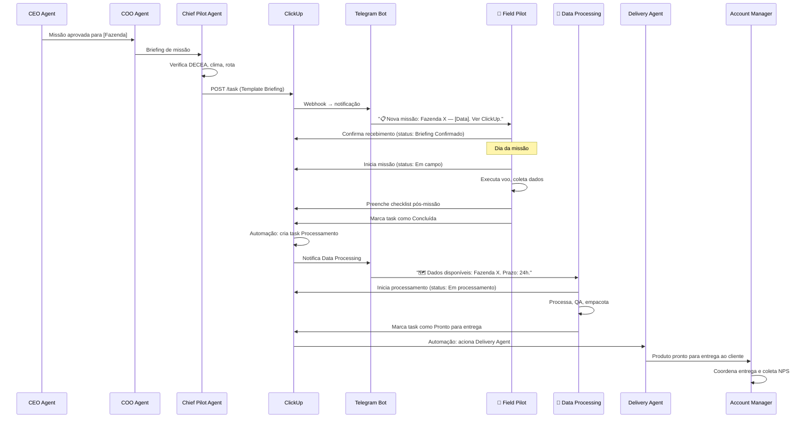

# ClickUp Integration — Agrostech Digital Company
## Orquestração de Trabalho Humano pela IA

```yaml
integration_id: "clickup_v2"
integration_name: "ClickUp Integration Layer"
purpose: "Ponte entre agentes digitais e TODOS os trabalhadores humanos da Agrostech"
primary_users:
  - "Field Pilot (Humano) — Operações"
  - "Data Processing Specialist (Humano) — Operações"
  - "Sales Representative ×4 (Humano) — Comercial"
  - "Account Manager (Humano) — Client Success"
version: "2.0"
updated: "Junho 2026"
scope: "Modelo Híbrido IA+Humano — Todos os papéis humanos cobertos"
```

---

## 1. Por que ClickUp?

O ClickUp é o **sistema de gestão de trabalho** que conecta os agentes digitais da Agrostech com **todos os seus trabalhadores humanos** — tanto na área operacional quanto na área comercial. Enquanto a IA orquestra estratégia, pipeline e lógica de negócio, o ClickUp traduz essas decisões em **tarefas concretas, checklists e notificações** para os humanos.

| Necessidade | Solução ClickUp |
|-------------|----------------|
| Chief Pilot cria briefing de missão → Piloto recebe | Task automática com template |
| Head of Sales gera briefing diário → Rep sabe o que fazer | Task diária priorizada por rep |
| IA gera proposta de vendas → Rep revisa e envia | Task com proposta attach para review |
| Humano precisa saber o que fazer hoje | Dashboard de tasks pessoais |
| Agente quer saber se missão foi concluída | Webhook no status da task |
| Lead está parado > 48h sem contato | Alerta automático para o rep |
| Dados precisam ser entregues | Checklist padronizado + upload link |
| Cliente precisa de onboarding | Task para Account Manager com briefing de conta |
| Histórico de missões e vendas | Tasks arquivadas como registro permanente |
| Gestão de prazo | Due dates + alertas automáticos |

---

## 2. Arquitetura da Integração

```
╔═══════════════════════════════════════════════════════════════╗
║           AGROSTECH DIGITAL COMPANY                           ║
║                                                               ║
║  CEO ► COO ► Chief Pilot [← Ops]                              ║
║  CEO ► Head of Sales [← Sales] ► Marketing Agent              ║
║                                                               ║
║          ┌────────────────────────────┐                       ║
║          │    ClickUp API Layer (v2.0)    │                       ║
║          │  • Operations Automation      │                       ║
║          │  • Commercial Automation      │                       ║
║          │  • Client Success Automation  │                       ║
║          └────────────────────────────┘                       ║
╚═══════════════════════════════════════════════════════════════╝
                         │
         ┌───────────────┴───────────────┐
         │                               │
    CLICKUP OPS                     CLICKUP COMMERCIAL
         │                               │
┌────────┴───────┐   ┌───────────────────┴─────────────┐
│                │   │                   │             │
▼                ▼   ▼                   ▼             ▼
👷FP            🗺️DP  👔SR×4              🤝AM        (futuro)
```

---

## 3. Estrutura de Espaços no ClickUp

### Organização Recomendada

```
Agrostech/
├── 📁 OPERATIONS (Space)
│   ├── 📋 Missões em Planejamento (List)
│   ├── 🛸 Missões Ativas (List)
│   ├── 🗺️ Processamento de Dados (List)
│   └── ✅ Missões Concluídas (List — Arquivo)
│
├── 📁 SALES (Space)
│   ├── 🎯 Pipeline de Vendas (Board Kanban — por rep)
│   ├── 📋 Briefings Diários por Rep (List)
│   ├── 📝 Propostas Geradas pela IA (List)
│   └── 📣 Campanhas de Marketing (List)
│
├── 📁 CLIENT SUCCESS (Space)
│   ├── 🤝 Onboarding de Clientes (List)
│   ├── 📦 Entregas Pendentes (List)
│   └── 📊 QBR e Follow-up (List)
│
└── 📁 SUPPORT (Space)
    ├── ⚖️ Pendências Legais (List)
    └── 🧾 Tarefas Financeiras (List)
```

---

## 4. Templates de Tasks Automáticas

### Template 1: Briefing de Missão (criado pelo Chief Pilot Agent)

```
TASK: 🚁 Missão: [NOME_FAZENDA] — [DATA]
Atribuída para: Field Pilot
Due Date: [DATA_MISSÃO - 1 dia] (para preparação)
Priority: High
Status: Briefing Recebido

DESCRIÇÃO (gerada automaticamente pelo agente):
━━━━━━━━━━━━━━━━━━━━━━━━━━━━━━━━━━━━━━━━
Cliente: [NOME]
Fazenda: [NOME_FAZENDA]
Área: [X] hectares
Tipo de missão: [Ortofoto / NDVI / MRV Carbono]
Coordenadas: [LAT, LON]
Data/Hora prevista: [DATA] às [HORA]
Autorização DECEA: ✅ [NÚMERO_AUTORIZAÇÃO]
NOTAM verificado: ✅ Sem restrições

PARÂMETROS DE VOO:
- Altitude: [X]m AGL
- Sobreposição: 80% frontal / 70% lateral
- GSD alvo: ≤ 3 cm/px
- Baterias necessárias: [N]
- Tempo estimado: [X] horas

GCPs: [N] pontos — coordenadas em: [LINK_ARQUIVO]
Software de missão: DroneDeploy / Pix4D — Plano: [LINK]

CONDIÇÕES METEOROLÓGICAS (previsão):
- Vento: [X] m/s — ✅ Dentro do limite
- Chuva: [previsão]
- Visibilidade: [X] km
━━━━━━━━━━━━━━━━━━━━━━━━━━━━━━━━━━━━━━━━

CHECKLIST PRÉ-MISSÃO (D-1):
☐ Baterias carregadas (100%)
☐ Hélices verificadas
☐ Câmera limpa e calibrada
☐ Firmware atualizado
☐ Cartão SD formatado
☐ GCPs (alvos de lona) preparados
☐ GNSS RTK com carga
☐ HD externo com espaço livre
☐ Extintor portátil incluído
☐ Seguro RPAS vigente confirmado
```

---

### Template 2: Checklist Pós-Missão (criado automaticamente no Dia D)

```
TASK: ✅ Pós-Missão: [NOME_FAZENDA] — [DATA]
Atribuída para: Field Pilot
Due Date: [DATA_MISSÃO] + 2 horas
Priority: Urgent

CHECKLIST PÓS-MISSÃO (preencher em campo):
☐ Imagens transferidas para HD externo
☐ Count de imagens: [___] de [___] esperadas
☐ Backup em nuvem realizado (link: _______)
☐ Log de voo preenchido:
    ├─ Hora início: _____
    ├─ Hora fim: _____
    ├─ Baterias utilizadas: [N]
    └─ Anomalias: _____
☐ GCPs: [N] coordenadas registradas em arquivo
☐ Fotos de campo tiradas (obstáculos, condições)
☐ Link de dados enviado para Data Processing: _____
☐ Qualquer anomalia documentada com foto

OBSERVAÇÕES DE CAMPO:
[Campo livre para o piloto escrever]
```

---

### Template 3: Task de Processamento de Dados (criada automaticamente quando Field Pilot conclui)

```
TASK: 🗺️ Processamento: [NOME_FAZENDA] — [DATA]
Atribuída para: Data Processing Specialist
Due Date: [DATA_MISSÃO + 24h]
Priority: High

DADOS DISPONÍVEIS:
- Link de download: [URL do HD/Nuvem]
- Quantidade de imagens: [N]
- GCPs: [N] pontos — arquivo: [LINK]
- Anomalias reportadas pelo piloto: [DESCRIÇÃO]
- Tipo de produto solicitado: [Ortofoto / NDVI / MRV]

CHECKLIST DE PROCESSAMENTO:
☐ Dados brutos recebidos e verificados
☐ GCPs importados e conferidos
☐ Processamento fotogramétrico iniciado
☐ Ortofoto gerada — GSD: [___] cm/px
☐ NDVI gerado (se aplicável)
☐ MDE gerado (se aplicável)

QA — CONTROLE DE QUALIDADE:
☐ Acurácia posicional: RMSE = [___] cm ✅/⚠️
☐ Cobertura: 100% sem lacunas ✅/⚠️
☐ Sem artefatos visíveis ✅/⚠️
☐ Relatório técnico revisado

EMPACOTAMENTO:
☐ Estrutura de pastas padronizada criada
☐ README_entrega.txt gerado
☐ Arquivos compactados — link: [URL]
☐ Delivery Agent notificado

STATUS: Em andamento → QA → Pronto para entrega
```

---

### Template 4: Briefing Diário do Sales Rep (criado pelo Head of Sales Agent — toda manhã)

```
TASK: 💼 Briefing Diário — [Nome do Rep] — [Data]
Atribuída para: Sales Rep [N]
Due Date: Hoje às 18:00
Priority: Normal

SEUS FOCOS DE HOJE (gerado pela IA com base no pipeline):
► URGENTES (ação hoje):
  • [Nome Fazenda 1] — proposta enviada há 5 dias sem resposta
    → Sugestão: ligar e perguntar se recebeu
  • [Nome Fazenda 2] — reunião prometida ainda não agendada
    → Sugestão: WhatsApp curto de confirmação

► OPORTUNIDADES QUENTES:
  • [Nome Fazenda 3] — lead qualificado gerado pelo Marketing ontem
    → Perfil: 800ha, soja, MT — Contato: [Nome] / [Telefone]

► PROPOSTAS AGUARDANDO REVIEW DA IA:
  • Proposta #P0XX — [Fazenda] — R$ [valor]
    Ver em: https://app.clickup.com/t/XXXXXX

SEU PIPELINE HOJE:
  Oportunidades abertas: [N] | Propostas enviadas: [N] | Meta do mês: [N] fechamentos
```

---

### Template 5: Proposta Gerada pela IA (revisada e enviada pelo Sales Rep)

```
TASK: 📝 Proposta #P[NUM] — [Nome Fazenda] — R$ [Valor]
Atribuída para: Sales Rep [N]
Due Date: Hoje + 24h (prazo para enviar ao cliente)
Priority: High
Status: Aguardando review do rep

DESCRIÇÃO (gerada pelo Head of Sales Agent):
━━━━━━━━━━━━━━━━━━━━━━━━━━━━━━━━━━━━━━━━
CLIENTE: [Nome Completo]
Fazenda: [Nome] | Área: [X]ha | Cultura: [X] | Estado: [X]
Dor identificada: [X]

SERVIÇOS RECOMENDADOS:
1. [Serviço principal] — R$ [valor]
2. [Serviço adicional opcional] — R$ [valor]

DESCONTO AUTOMÁTICO APLICADO: [X]% (dentro da autonomia do rep)
PRAZO DE ENTREGA: 48h após missão
VALIDADE: 15 dias
━━━━━━━━━━━━━━━━━━━━━━━━━━━━━━━━━━━━━━━━

CHECKLIST PARA O REP:
☐ Revisar proposta e personalizar com insights da conversa
☐ Verificar prazo de entrega com COO (se necessário)
☐ Solicitar aprovação do Head of Sales (se desconto > 5%)
☐ Enviar ao cliente com assinatura pessoal
☐ Registrar envio no CRM: mudar status para "Proposta Enviada"
```

---

### Template 6: Onboarding de Novo Cliente (Account Manager)

```
TASK: 🤝 Onboarding: [Nome Cliente] — [Nome Fazenda]
Atribuída para: Account Manager
Due Date: Hoje + 24h (contato inicial em até 24h do fechamento)
Priority: High
Status: Novo cliente

BRIEFING DA CONTA (gerado pelo Head of Sales Agent):
━━━━━━━━━━━━━━━━━━━━━━━━━━━━━━━━━━━━━━━━
CLIENTE: [Nome] | Fazenda: [Nome] | Área: [X]ha
Contrato: [tipo] — R$ [valor] | Missão: [data agendada]
Sales Rep responsável: [nome] — contexto: [resumo da venda]
Dores mapeadas: [o que o cliente quer resolver]
Expectat/ivas comunicadas: [o que foi prometido]━━━━━━━━━━━━━━━━━━━━━━━━━━━━━━━━━━━━━━━━

CHECKLIST DE ONBOARDING:
☐ Fazer onboarding call (em até 24h do fechamento)
☐ Apresentar processo da Agrostech
☐ Confirmar data e local da missão com o cliente
☐ Registrar notas da call no ClickUp
☐ Adicionar cliente ao grupo WhatsApp de comunicação
☐ Configurar lembrete para update no dia do voo
```

---

### Template 7: Briefing Mensal de Conteúdo (criado pelo Marketing Agent)

```
TASK: 📣 Briefing Mensal de Conteúdo — [MÊS/ANO]
Atribuída para: Content Director
Due Date: Dia 25 do mês anterior
Priority: High
Status: Planejamento

DESCRIÇÃO (gerado automaticamente pelo Marketing Agent):
━━━━━━━━━━━━━━━━━━━━━━━━━━━━━━━━━━━━━━━━
MÊS/ANO: [Mês/Ano]
OBJETIVOS DE LEAD MAGNET: [Ex: Guia de Crédito de Carbono]
FOCOS DE CAMPANHA: [Ex: Planejamento da safra de soja em MT]
CULTURAS EM FOCO: [Ex: Soja, Milho]

DISTRIBUIÇÃO DE CONTEÚDO ESPERADA:
- Posts estáticos / Carrosséis: [N]
- Reels (Instagram): [N]
- TikToks (nativos): [N]
━━━━━━━━━━━━━━━━━━━━━━━━━━━━━━━━━━━━━━━━

CHECKLIST DO DIRETOR DE CONTEÚDO:
☐ Elaborar calendário editorial completo
☐ Atribuir tarefas de geração de imagem para o Instagram Image Agent
☐ Atribuir tarefas de roteiro para o Instagram Reels Agent
☐ Atribuir tarefas de roteiro nativo para o TikTok Agent
☐ Definir diretrizes visuais específicas para o Visual Identity Agent
```

---

### Template 8: Card de Post / Conteúdo (criado pelo Content Director)

```
TASK: 📝 Post: [Título do Post] — [Plataforma] — [Data]
Atribuída para: Image Agent / Reels Agent / TikTok Agent
Due Date: Data de Publicação - 2 dias (para aprovação)
Priority: Normal
Status: Criação

DETALHES DO BRIEFING (gerado pelo Content Director):
━━━━━━━━━━━━━━━━━━━━━━━━━━━━━━━━━━━━━━━━
PLATAFORMA: [Instagram / TikTok / Ambas]
FORMATO: [Carrossel / Post Único / Reel / TikTok Nativo]
PILAR: [Tech / Resultado / Carbono / Voz do Produtor]
PÚBLICO-ALVO: [Decisor Millennial / Gen-Z / Ambos]
HOOK SUGERIDO: [Ideia de gancho]
━━━━━━━━━━━━━━━━━━━━━━━━━━━━━━━━━━━━━━━━

CHECKLIST DE GERAÇÃO:
☐ Criar conceito criativo e roteiro
☐ Gerar prompts de imagem (se aplicável)
☐ Selecionar trilha sonora e hook de áudio (se aplicável)
☐ Escrever legenda / caption com hashtags e CTA
☐ Enviar para aprovação do Visual Identity Agent
```

---

### Template 9: Revisão e Validação de Marca (Visual Identity Agent)

```
TASK: 🎨 Revisão de Marca: [Título do Post]
Atribuída para: Visual Identity Agent
Due Date: Data de Publicação - 1 dia
Priority: High
Status: Em Revisão

CHECKLIST DE REVISÃO VISUAL:
☐ Cores primárias de acordo com o Brand Style Guide (Verde Terra / Laranja Cerrado)
☐ Tipografia Montserrat para headlines e Inter para dados
☐ Logotipo oficial presente nas proporções corretas
☐ Acessibilidade: Contraste mínimo de 4.5:1
☐ Legibilidade: Texto ocupa menos de 20% da imagem
☐ Linguagem nativa e adequada ao canal (especialmente TikTok)
```

---

### Regra 1: Missão Aprovada → Cria Briefing
```
GATILHO: Task "Missão Aprovada" status muda para "Confirmada"
AÇÃO:    Criar task "🚁 Missão: [Nome]" a partir do Template 1
         Atribuir para: Field Pilot
         Notificação: Telegram Bot envia msg para Field Pilot
```

### Regra 2: Pós-Missão Concluída → Aciona Processamento
```
GATILHO: Task "✅ Pós-Missão" status muda para "Concluída"
AÇÃO:    Criar task "🗺️ Processamento: [Nome]" a partir do Template 3
         Atribuir para: Data Processing Specialist
         Notificação: Telegram Bot envia msg para Data Processing
         COO Agent recebe webhook: missão concluída
```

### Regra 3: Processamento Concluído → Aciona Entrega
```
GATILHO: Task "🗺️ Processamento" status muda para "Pronto para entrega"
AÇÃO:    Criar task "📦 Entrega: [Nome]" para Delivery Agent
         Notificação: Account Manager Agent recebe webhook
         SLA timer inicia para acompanhamento de satisfação
```

### Regra 4: Prazo Vencendo → Alerta de Urgência
```
GATILHO: Task com due date < 2 horas E status != Concluída
AÇÃO:    Telegram Bot envia alerta urgente ao responsável
         COO Agent recebe notificação de risco de SLA
```

### Regra 5: Briefing Mensal Criado → Notifica Content Director
```
GATILHO: Task "📣 Briefing Mensal de Conteúdo" criada no ClickUp
AÇÃO:    Automação cria lista de cards de posts
         Notificação: Telegram envia mensagem para o Content Director
```

### Regra 6: Conteúdo Criado pelo Sub-agente → Aciona Revisão de Marca
```
GATILHO: Task "📝 Post" no status "Pronto para Revisão Visual"
AÇÃO:    Criar task "🎨 Revisão de Marca: [Título]" a partir do Template 9
         Atribuir para: Visual Identity Agent
```

### Regra 7: Revisão de Marca Concluída → Solicita Gate Final e Aprovação Humana
```
GATILHO: Task "🎨 Revisão de Marca" status muda para "Aprovado"
AÇÃO:    Task "📝 Post" status muda para "Aguardando Aprovação Humana"
         Notificação: Telegram envia card de aprovação para o Diretor Humano
```

---

## 6. Dashboards por Papel

### Field Pilot — Dashboard Móvel (acesso pelo app ClickUp)
```
📱 MINHA AGENDA HOJE
├── 🚁 Missão: Fazenda São João — 08:00
│   Status: Briefing recebido
│   [Abrir briefing] [Marcar iniciado]
│
├── ✅ Pós-Missão: Fazenda São João
│   Status: Pendente após missão
│   [Preencher checklist]
│
└── 📋 D-1: Preparação — Fazenda Boa Vista (amanhã)
    [Ver checklist de equipamentos]
```

### Data Processing — Dashboard Desktop
```
💻 FILA DE PROCESSAMENTO
├── 🔴 URGENTE: Fazenda São João (vence em 6h)
│   Dados recebidos: 13:45
│   [Abrir task] [Marcar em processamento]
│
├── 🟡 EM ANDAMENTO: Fazenda Verde (vence amanhã)
│   Status: Processamento fotogramétrico
│   [Atualizar status]
│
└── 🟢 AGUARDANDO: Fazenda Bela Vista (vence em 2 dias)
    [Ver detalhes]
```

### Sales Rep — Dashboard Móvel
```
📱 MINHA AGENDA COMERCIAL — [Data]
━━━━━━━━━━━━━━━━━━━━━━━━━━━━━━━━━━━
🔴 URGENTE (ação hoje)
  • Fazenda Boa Vista — follow-up há 5 dias
    [Ligar agora] [Registrar tentativa]

🟡 ATENÇÃO (esta semana)
  • Cooperativa Sul — proposta em análise
  • Pedro Alves — lead quente do Marketing

🟢 REVISAR E ENVIAR
  • Proposta #P045 — Fazenda Esperança — R$ 18.000
    [Revisar] [Enviar ao cliente]

📊 MEU PIPELINE: 12 oport. | 3 propostas | Meta: 2 fechamentos
━━━━━━━━━━━━━━━━━━━━━━━━━━━━━━━━━━━
```

### Account Manager — Dashboard Desktop
```
💻 MINHA CARTEIRA — [Data]
━━━━━━━━━━━━━━━━━━━━━━━━━━━━━━━━━━━
🔴 AÇÃO HOJE
  • Carlos Mendes — NPS 6 ⚠️ Ligar agora
  • Fazenda Verde — missão hoje → update ao cliente

🟡 ESTA SEMANA
  • Cooperativa Sul — entrega pronta, agendar apresentação
  • Pedro Lima — renovação vence em 15 dias

🟢 EM DIA
  • João Mendes — NPS 9, contrato ativo

📊 CARTEIRA: 8 clientes | NPS médio: 72 | 2 renovações este mês
━━━━━━━━━━━━━━━━━━━━━━━━━━━━━━━━━━━
```

---

## 7. Configuração Técnica da Integração

### API ClickUp — Endpoints Principais

```python
# Exemplo de como o Chief Pilot Agent cria uma task via ClickUp API
import requests

CLICKUP_API_TOKEN = "pk_XXXXXXXX"
LIST_ID_OPERATIONS = "XXXXXXXX"  # List "Missões Ativas"

def criar_briefing_missao(fazenda, data, area_ha, tipo_missao, 
                           coordenadas, autorizacao_decea, 
                           parametros_voo, assignee_id):
    """
    Chamado pelo Chief Pilot Agent após aprovação de missão.
    Cria task de briefing no ClickUp para o Field Pilot (humano).
    """
    url = f"https://api.clickup.com/api/v2/list/{LIST_ID_OPERATIONS}/task"
    
    payload = {
        "name": f"🚁 Missão: {fazenda} — {data}",
        "description": gerar_descricao_briefing(
            fazenda=fazenda,
            area_ha=area_ha,
            tipo_missao=tipo_missao,
            coordenadas=coordenadas,
            autorizacao=autorizacao_decea,
            parametros=parametros_voo
        ),
        "assignees": [assignee_id],
        "due_date": calcular_due_date(data, dias_antes=1),
        "priority": 2,  # High
        "tags": ["missao", fazenda.lower().replace(" ", "-")],
        "checklist": [
            {"name": "Baterias carregadas (100%)"},
            {"name": "Hélices verificadas"},
            {"name": "Câmera limpa e calibrada"},
            {"name": "Cartão SD formatado"},
            {"name": "GCPs preparados"},
            {"name": "HD externo com espaço livre"},
        ]
    }
    
    headers = {
        "Authorization": CLICKUP_API_TOKEN,
        "Content-Type": "application/json"
    }
    
    response = requests.post(url, json=payload, headers=headers)
    task_id = response.json()["id"]
    
    # Dispara notificação Telegram após criar a task
    notificar_telegram_field_pilot(
        mensagem=f"📋 Nova missão atribuída: {fazenda} em {data}\n"
                 f"🔗 Ver briefing completo: https://app.clickup.com/t/{task_id}"
    )
    
    return task_id


def monitorar_status_missao(task_id: str):
    """
    Webhook handler: chamado quando Field Pilot atualiza status no ClickUp.
    COO Agent recebe o update para rastreamento de operações.
    """
    url = f"https://api.clickup.com/api/v2/task/{task_id}"
    headers = {"Authorization": CLICKUP_API_TOKEN}
    
    task = requests.get(url, headers=headers).json()
    status = task["status"]["status"]
    
    if status == "concluída":
        # Aciona automação: cria task de Data Processing
        acionar_data_processing(task)
        # Notifica COO Agent
        notificar_coo_agent(evento="missao_concluida", task=task)
```

---

## 8. Fluxo Completo de uma Missão (End-to-End)



---

## 9. Implantação — Passos de Setup

### Fase 1 — Configuração Inicial (1 semana)
1. Criar conta ClickUp Business (recomendado para automações)
2. Montar estrutura de Spaces, Lists e Templates conforme seções 3 e 4
3. Adicionar **todos os funcionários humanos** como membros:
   - Operations: Field Pilot, Data Processing Specialist
   - Sales: Sales Rep ×4
   - Client Success: Account Manager
4. Configurar permissões por papel (ver seção 10)

### Fase 2 — Automações Operacionais (3-5 dias)
1. Criar automações de Regras 1-4 (Operations)
2. Configurar webhooks para agentes de Operações
3. Integrar Chief Pilot Agent com ClickUp API
4. Testar fluxo completo de missão com simulação

### Fase 3 — Automações Comerciais (3-5 dias)
1. Criar automações de Regras 5-8 (Commercial)
2. Integrar Head of Sales Agent com ClickUp API (pipeline + propostas)
3. Configurar briefings diários automáticos por rep
4. Testar fluxo completo de venda com simulação

### Fase 4 — Telegram (paralelo à Fase 3)
1. Ver `integrations/telegram_integration.md` para setup
2. Conectar Telegram Bot ao ClickUp via webhooks
3. Testar notificações de ponta a ponta para todos os papéis

---
## 10. Permissões por Papel no ClickUp (Modelo Híbrido Completo)

| Papel | Tipo | Space(s) | Permissão | Pode Ver | Pode Editar |
|-------|------|---------|-----------|----------|-------------|
| **CEO** | 🤖 Digital (API) | Todos | API Admin | Tudo | Tudo via API |
| **COO** | 🤖 Digital (API) | Todos | API Admin | Todos os Spaces | Tudo via API |
| **CFO** | 🤖 Digital (API) | Finance, Sales | API Admin | Finance + Sales | Reports financeiros |
| **Head of Sales** | 🤖 Digital (API) | Sales | API Admin | Tudo em Sales | Criar/editar tasks de vendas |
| **Chief Pilot** | 🤖 Digital (API) | Operations | API Admin | Tudo em Operations | Criar/editar tasks de ops |
| **Field Pilot** | 👷 Humano | Operations | Member | Suas tasks + equipe Ops | Apenas suas tasks |
| **Data Processing** | 👷 Humano | Operations | Member | Suas tasks + equipe Ops | Apenas suas tasks |
| **Sales Rep (cada)** | 👔 Humano | Sales | Member | Seu pipeline + propostas atribuídas | Seu CRM e suas tasks |
| **Account Manager** | 🤝 Humano | Client Success + Sales (leitura) | Member | Carteira completa + pipeline (read) | Suas tasks de cliente |
| Marketing | 🤖 Digital (API) | Sales | API Member | Sales Space | Criar leads e campanhas |
| **Content Director** | 🤖 Digital (API) | Sales | API Member | Sales Space | Gerenciar campanhas e post-cards |
| **Image Agent** | 🤖 Digital (API) | Sales | API Member | Campanhas de Marketing | Editar post-cards de imagem |
| **Reels Agent** | 🤖 Digital (API) | Sales | API Member | Campanhas de Marketing | Editar post-cards de Reels |
| **TikTok Agent** | 🤖 Digital (API) | Sales | API Member | Campanhas de Marketing | Editar post-cards de TikTok |
| **Visual Identity** | 🤖 Digital (API) | Sales | API Member | Campanhas de Marketing | Criar e revisar tasks de marca |

---

*Agrostech | ClickUp Integration v2.0 | Junho 2026*
*"A IA pensa, equipa e alerta. O humano decide, executa e se relaciona. O ClickUp garante que nada se perca."*
